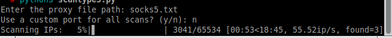

# Proxy Range Scanner

The Proxy Range Scanner is designed to find additional proxies within Class B IP ranges, based on a list of known good proxies. This scanner is unique because it exploits the likelihood of finding additional proxies within the same range as an already known good proxy.

## How It Works

1. **Start with a list of proxies:** Obtain a list of SOCKS5 proxies in the `proxy:port` format.
2. **Run the scanner:** The scanner will prompt for the file location of the proxy list.
3. **Specify the port:** Decide whether to scan using a custom port or the proxy's original port.

The scanner takes each proxy and port from the list, resets the last two octets to zero, and scans the entire range up to `.255.255` on the respective port. This method can potentially uncover thousands of proxies.

## Requirements

- Python 3.3 or later.
- Libraries:
  - `requests` (with SOCKS support)
  - `concurrent.futures` (included in the standard Python library)
  - `tqdm`

## Installation

### Requests with SOCKS Support

1. Open a terminal or command prompt.
2. Install `requests` with SOCKS support using pip:
   ```bash
   pip install requests[socks]
   ```
   This installs `requests` and `PySocks`.

### tqdm

1. Open your terminal or command prompt.
2. Install `tqdm` using pip:
   ```bash
   pip install tqdm
   ```

### Verifying the Installation

- To check if `tqdm` is installed correctly, execute:
  ```bash
  python -c "import tqdm; print(tqdm.version)"
  ```
- To verify `requests` and `concurrent.futures`, run:
  ```bash
  python -c "import requests, concurrent.futures; print('requests:', requests.version)"
  ```
  This confirms the `requests` library version. Since `concurrent.futures` is part of the standard library, its presence confirms a successful setup.

### Note

Ensure Python is added to your system's PATH during installation. This makes it accessible from the terminal or command prompt.

By following these steps, you can set up the Proxy Range Scanner and potentially discover a vast number of new proxies within specified IP ranges.


